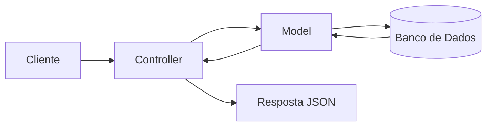
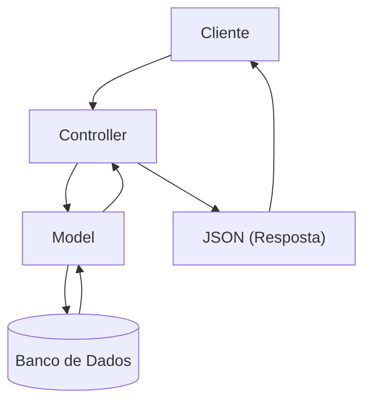
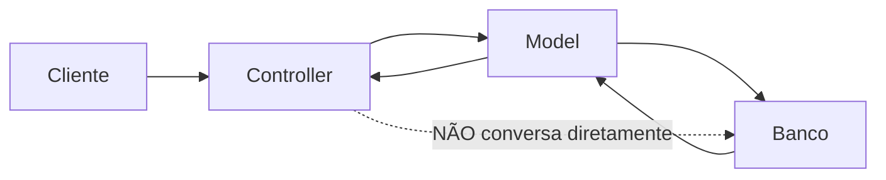
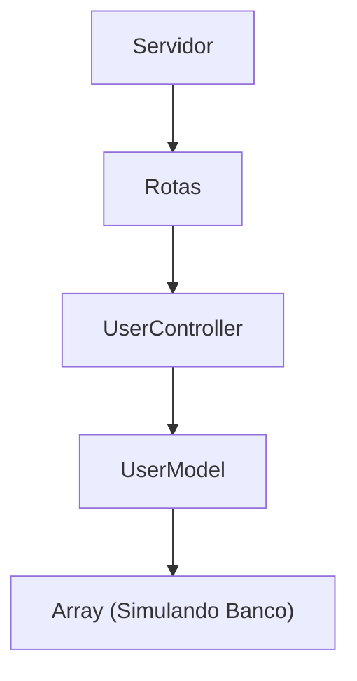
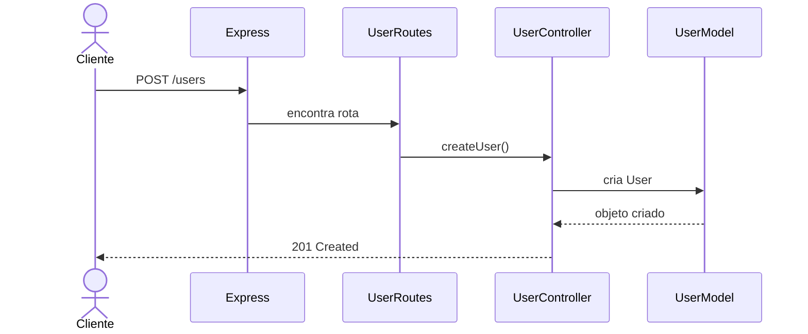

# **Aula 3: Models, Views (só que não), e Controllers no Express**

## 🎯 Objetivos da Aula

* Entender o conceito de **MVC (Model-View-Controller)** e sua importância.
* Aprender a estruturar um projeto Express utilizando o padrão MVC.
* Compreender por que **não utilizaremos a camada View** nesta UC.
* Criar um CRUD básico seguindo essa organização.

---

# 📌 1. O que é MVC?

O **MVC (Model-View-Controller)** é um dos padrões de arquitetura mais conhecidos no desenvolvimento de software. Seu principal objetivo é **separar responsabilidades**, deixando cada parte da aplicação responsável por apenas uma tarefa.

Imagine uma lanchonete:

* 👨‍🍳 **Model** → É a cozinha. Responsável por armazenar e manipular os dados.
* 👨‍💼 **Controller** → É o atendente. Recebe o pedido do cliente, conversa com a cozinha e entrega a resposta.
* 🧑‍💻 **View** → É o balcão ou aplicativo onde o cliente faz o pedido.

---

## As três camadas

### ✅ Model (Modelo)

Responsável pelos **dados** da aplicação.

Ele representa entidades como:

* Usuário
* Produto
* Cliente
* Pedido

Além disso, normalmente conversa com o banco de dados.

---

### ✅ Controller (Controlador)

Recebe as requisições HTTP.

Ele:

* recebe os dados enviados pelo cliente;
* valida informações básicas;
* chama o Model;
* devolve uma resposta.

É o "cérebro" da aplicação.

---

### ✅ View (Visão)

É a interface utilizada pelo usuário.

Exemplos:

* HTML
* React
* Angular
* Vue
* Aplicativos Mobile

---

# 🤔 Mas... cadê a View?

Nesta Unidade Curricular estamos desenvolvendo **uma API REST**.

Uma API **não possui interface gráfica**.

Ela apenas recebe requisições e responde normalmente em JSON.

Por isso nossa arquitetura será praticamente um:

```
Model
   ▲
   │
Controller
```

Ou, se quisermos ser mais sinceros...

> **MVC sem o V** 😂

A View será construída futuramente em outra aplicação (HTML, React, Mobile etc.), que consumirá nossa API.

---

# 📊 Fluxo de uma Requisição



Observe que:

* o cliente nunca conversa diretamente com o banco;
* toda comunicação passa pelo Controller.

---

# 📊 Como funciona cada camada?



---

# 📊 Quem conversa com quem?



---

# 💡 Por que usar MVC?

Sem organização, rapidamente o projeto fica parecido com isso:

```
server.ts

3000 linhas

✔ Rotas
✔ Banco
✔ Validação
✔ Regras de negócio
✔ Login
✔ Produtos
✔ Clientes
✔ Pedidos
✔ Tudo junto
```

Resultado?

😨 Difícil de manter.

😨 Difícil de encontrar erros.

😨 Difícil trabalhar em equipe.

---

Com MVC:

```
Controllers/
    UserController.ts

Models/
    User.ts

Routes/
    UserRoutes.ts
```

Cada arquivo possui apenas uma responsabilidade.

Isso torna o código:

✔ organizado

✔ reutilizável

✔ fácil de testar

✔ fácil de dar manutenção

---

# 🏗 2. Criando um Projeto Express com MVC

Vamos iniciar um projeto do zero.

## Passo 1 - Criando o Projeto

```bash
npm init -y

npm install express

npm install typescript ts-node-dev @types/node @types/express -D
```

No `package.json` adicione:

```json
"scripts": {
    "dev": "npx ts-node-dev src/server.ts"
}
```

Execute:

```bash
npm run dev
```

---

## Passo 2 - Estrutura de Pastas

```
express-mvc/
│
├── src/
│
├── controllers/
│      UserController.ts
│
├── models/
│      User.ts
│
├── routes/
│      UserRoutes.ts
│
├── server.ts
│
├── package.json
│
└── tsconfig.json
```

---

# 📊 Organização do Projeto



Observe que cada pasta possui uma responsabilidade específica.

---

# 🛠 3. Implementando um CRUD Simples com MVC

Agora vamos criar nosso primeiro CRUD utilizando essa estrutura.

---

## 📦 Model (Usuário) — `models/User.ts`

```ts
export class User {

    public id: number;
    public nome: string;
    public email: string;

    constructor(id: number, nome: string, email: string) {
        this.id = id;
        this.nome = nome;
        this.email = email;
    }
}

export let usuarios: User[] = [];
```

Neste primeiro momento ainda **não utilizaremos banco de dados**.

Nosso array `usuarios` será uma simulação da tabela do banco.

---

## 🎯 Controller — `controllers/UserController.ts`

```ts
import { Request, Response } from "express"
import { User, usuarios } from "../models/User"

export class UserController {

    createUser(req: Request, res: Response): Response {
        const { id, nome, email } = req.body;

        if (!id || !nome || !email) {
            return res.status(400).json({ mensagem: "Id, nome, email precisam ser informados!" });
        }

        const usuario = new User(id, nome, email);
        usuarios.push(usuario);

        return res.status(201).json({
            mensagem: "Usuário criado com sucesso!",
            usuario
        });
    }

    listAllUsers(req: Request, res: Response): Response {
        return res.status(200).json({ users: usuarios });
    }

    updateUser(req: Request, res: Response): Response {

        const id = Number(req.params.id);
        const { nome, email } = req.body;

        if (!nome || !email) {
            return res.status(400).json({
                mensagem: "Nome e e-mail são obrigatórios!"
            });
        }

        let usuario = usuarios.find(user => user.id === id);

        if (!usuario) {
            return res.status(404).json({
                mensagem: "Usuário não encontrado!"
            });
        }

        usuario.nome = nome;
        usuario.email = email;

        return res.status(200).json({
            mensagem: "Usuário atualizado com sucesso!",
            usuario_atualizado: usuario
        });
    }

    deleteUser(req: Request, res: Response): Response {

        const id = Number(req.params.id);

        const index = usuarios.findIndex(user => user.id === id);

        if (index === -1) {
            return res.status(404).json({
                mensagem: "Usuário não encontrado!"
            });
        }

        usuarios.splice(index, 1);

        return res.status(204).send();
    }

}
```

Observe que **nenhuma rota possui regra de negócio**.

Toda a lógica está concentrada no Controller.

---

## 🔗 Rotas — `routes/UserRoutes.ts`

```ts
import { Router } from "express";
import { UserController } from "../controllers/UserController";

const router = Router();

const controller = new UserController();

router.get("/users", controller.listAllUsers);

router.post("/users", controller.createUser);

router.put("/users/:id", controller.updateUser);

router.delete("/users/:id", controller.deleteUser);

export default router;
```

As rotas possuem apenas uma responsabilidade:

➡ encaminhar a requisição para o Controller.

---

## 🚀 Servidor — `server.ts`

```ts
import express, { Application } from "express";
import userRoutes from "./routes/UserRoutes";

const app: Application = express();

const PORT = 3000;

app.use(express.json());

app.use(userRoutes);

app.listen(PORT, () => {
    console.log(`Servidor rodando em http://localhost:${PORT}`);
});
```

Agora nossa API está pronta.

---

# 📊 Fluxo do CRUD

Quando fazemos um POST:



---

# ✅ 4. Testando a API

Utilize o **Thunder Client**.

---

## Criar Usuário

**POST /users**

```json
{
    "id":1,
    "nome":"Daniel",
    "email":"daniel@email.com"
}
```

---

## Listar Usuários

**GET /users**

Resposta:

```json
[
    {
        "id":1,
        "nome":"Daniel",
        "email":"daniel@email.com"
    }
]
```

---

## Atualizar

**PUT /users/1**

```json
{
    "nome":"Daniel Atualizado",
    "email":"email@atualizado.com"
}
```

---

## Deletar

**DELETE /users/1**

Retorna:

```
204 No Content
```

---

# 🎯 5. Exercícios

## Exercício 1

Crie um CRUD completo para **Produtos**.

Campos:

* id
* nome
* preco
* quantidade

---

## Exercício 2

Implemente também:

```
GET /products/:id
```

Retornando apenas um produto.

---

## Exercício 3

Antes de cadastrar um usuário, verifique se já existe outro usuário com o mesmo e-mail.

Caso exista, retorne:

```
409 Conflict
```

---

## Exercício 4

No cadastro de produtos:

* preço não pode ser negativo;
* quantidade não pode ser negativa.

Caso aconteça, retornar:

```
400 Bad Request
```

---

## Exercício 5

Adicione um endpoint:

```
GET /users/count
```

Resposta:

```json
{
    "total": 15
}
```

---

## Exercício 6

Crie uma entidade **Categoria**.

Campos:

* id
* nome

Implemente o CRUD completo.

---

## Exercício 7

Desafio:

Monte o seguinte projeto:

```
controllers/
    UserController.ts
    ProductController.ts
    CategoryController.ts

models/
    User.ts
    Product.ts
    Category.ts

routes/
    UserRoutes.ts
    ProductRoutes.ts
    CategoryRoutes.ts
```

Depois registre todas as rotas no `server.ts`.

---

# 🔥 Resumo da Aula

✅ Aprendemos o padrão **MVC** e a importância da separação de responsabilidades.

✅ Entendemos por que **não utilizamos a camada View** em uma API REST.

✅ Organizamos um projeto em **Models, Controllers e Routes**.

✅ Construímos um CRUD completo de usuários.

✅ Visualizamos o fluxo de funcionamento da aplicação através de diagramas.
