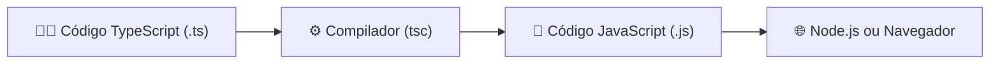

# 🏷️ Parte 1 — Fundamentos do TypeScript para Desenvolvimento Backend

> [!NOTE]
> Antes de construir APIs, conectar bancos de dados ou criar aplicações completas, precisamos dominar a principal ferramenta utilizada durante toda a disciplina: **o TypeScript**.
>
> Nesta aula aprenderemos os fundamentos da linguagem e entenderemos por que ela se tornou praticamente um padrão no desenvolvimento moderno.

---

# 🎯 Objetivos da Aula

Ao final desta aula você será capaz de:

- Entender por que o TypeScript foi criado;
- Diferenciar JavaScript de TypeScript;
- Compreender o processo de transpilação;
- Criar projetos TypeScript;
- Conhecer a estrutura básica de um projeto Backend.

---

# 📖 O que veremos hoje?

- O problema do JavaScript
- O nascimento do TypeScript
- Como o TypeScript funciona
- Processo de Transpilação
- Estrutura de um projeto
- Configuração do ambiente

---

# 🤔 O JavaScript é ruim?

Essa é uma pergunta que muita gente faz quando conhece o TypeScript.

A resposta é:

> **Não!**

JavaScript é uma linguagem fantástica e revolucionou o desenvolvimento Web.

Mas existe um detalhe interessante...

O JavaScript foi criado por **Brendan Eich** em apenas **10 dias**, em 1995.

Naquela época, seu objetivo era ser uma linguagem extremamente simples e flexível para executar pequenos scripts dentro do navegador.

Essa flexibilidade trouxe algumas consequências.

---

# 📦 Uma linguagem muito permissiva

Observe o código abaixo.

```javascript
function somar(a, b) {
    return a + b;
}

console.log(somar(10, 20));
console.log(somar("10", 20));
console.log(somar(true, 20));
```

## 🤔 Antes de executar...

**O que você acha que será exibido no console?**

Pense por alguns segundos antes de continuar.

---

## Resultado

```text
30
1020
21
```

---

## Mas... por quê?

O operador **+** possui comportamentos diferentes dependendo dos tipos envolvidos.

| Operação | Resultado |
|----------|-----------|
| Número + Número | Soma |
| String + Qualquer coisa | Concatenação |
| Boolean + Número | Conversão automática |

Isso significa que o JavaScript tenta "adivinhar" o que você queria fazer.

Essa característica é conhecida como **Coerção de Tipos (Type Coercion)**.

> [!TIP]
> O JavaScript procura fazer o programa continuar funcionando ao invés de interromper sua execução.

---

# Outro exemplo...

Considere agora este código.

```javascript
const aluno = {
    nome: "Maria"
}

console.log(aluno.idade);
console.log(aluno.idade.toFixed(2));
```

---

## O que acontece?

A primeira linha imprime:

```text
undefined
```

Até aí tudo bem...

Mas a segunda linha produz:

```text
TypeError:
Cannot read properties of undefined
```

---

## O problema

O JavaScript só descobriu que havia um erro **quando o programa já estava sendo executado**.

Imagine descobrir isso depois que seu sistema já está em produção.

É justamente esse tipo de situação que o TypeScript tenta evitar.

> [!WARNING]
> Encontrar erros durante a execução costuma ser muito mais caro do que encontrá-los durante o desenvolvimento.

---

# 🚀 Entra em cena o TypeScript

Agora veja o mesmo exemplo utilizando TypeScript.

```typescript
function somar(a: number, b: number): number {
    return a + b;
}

somar("10", 20);
```

Antes mesmo de executar...

O VSCode já informa:

```text
Argument of type 'string'
is not assignable to parameter of type 'number'.
```

O programa nem precisa ser executado.

O erro foi encontrado imediatamente.

---

# 💡 Então o TypeScript corrige o JavaScript?

Não.

Essa é uma confusão bastante comum.

O TypeScript **não altera o funcionamento do JavaScript**.

Ele apenas adiciona informações sobre os tipos dos dados e verifica se tudo está consistente antes da execução.

Em outras palavras:

- JavaScript continua existindo;
- o TypeScript apenas ajuda você a escrever JavaScript melhor.

---

# 🎒 A analogia da mala de viagem

Imagine que você vai viajar.

## JavaScript

É como uma mala sem divisórias.

Você pode colocar qualquer coisa.

- 👕 Camiseta
- 📚 Livro
- 👟 Sapato
- 🥤 Garrafa
- 🖥️ Notebook

Tudo fica misturado.

Na hora de procurar alguma coisa...

Boa sorte.

Talvez você encontre o que queria.

Talvez descubra apenas quando chegar ao destino.

---

## TypeScript

Agora imagine uma mala organizada.

Cada compartimento possui uma etiqueta.

```
👕 Roupas

👟 Calçados

💻 Eletrônicos

🪥 Higiene
```

Se você tentar colocar um notebook dentro do compartimento das roupas...

Alguém avisa imediatamente.

Você corrige o problema antes mesmo da viagem começar.

Essa é exatamente a ideia do TypeScript.

> [!IMPORTANT]
> O TypeScript encontra muitos erros **antes** da execução do programa.

---

# JavaScript x TypeScript

| JavaScript | TypeScript |
|------------|------------|
| Tipagem dinâmica | Tipagem estática |
| Descobre vários erros em tempo de execução | Descobre vários erros durante o desenvolvimento |
| Mais flexível | Mais seguro |
| Não precisa compilação | Precisa ser transpilado |
| Navegador executa diretamente | Precisa virar JavaScript |

---

# 🏗️ Como o TypeScript funciona?

Uma dúvida muito comum é:

> Se o navegador só entende JavaScript...
>
> Como um programa escrito em TypeScript consegue funcionar?

A resposta está na **transpilação**.

---

# 🔄 Processo de Transpilação



---

## O fluxo completo

1. O desenvolvedor escreve código em TypeScript.

2. O compilador (`tsc`) analisa os tipos.

3. Caso encontre erros, informa imediatamente.

4. Se tudo estiver correto, gera arquivos JavaScript.

5. O Node.js ou o navegador executa o JavaScript normalmente.

> [!NOTE]
> O navegador **não executa TypeScript**.
>
> Ele executa apenas o JavaScript gerado pelo compilador.

---

# 📂 Estrutura de um Projeto

Uma estrutura bastante comum é:

```text
meu-projeto/

│ package.json

│ tsconfig.json

│ node_modules/

│ src/

│   index.ts

│ dist/

└── README.md
```

### Significado de cada pasta

| Item | Descrição |
|------|-----------|
| src | Código-fonte |
| dist | JavaScript gerado |
| package.json | Dependências do projeto |
| tsconfig.json | Configuração do compilador |
| node_modules | Bibliotecas instaladas |

---

# ⚙️ Criando um projeto TypeScript

Primeiro criamos o projeto.

```bash
npm init -y
```

---

Depois instalamos o TypeScript.

```bash
npm install -D typescript
```

> [!TIP]
> O parâmetro **-D** instala o pacote apenas como dependência de desenvolvimento.

---

Agora criamos o arquivo de configuração.

```bash
npx tsc --init
```

Será criado o arquivo:

```text
tsconfig.json
```

Esse arquivo controla como o TypeScript irá gerar o JavaScript.

---

# 🧠 Resumindo

Até aqui aprendemos que:

- JavaScript é extremamente flexível.
- Essa flexibilidade pode gerar erros difíceis de encontrar.
- O TypeScript adiciona segurança ao desenvolvimento.
- O navegador continua executando JavaScript.
- O TypeScript precisa ser convertido antes da execução.

---

# 💬 Perguntas para discussão

Antes de continuar a aula, converse com seus colegas.

1. Você já encontrou algum erro que só apareceu quando executou um programa?

2. Você acha que escrever um pouco mais de código vale a pena para evitar erros?

3. Em um sistema bancário ou hospitalar, você usaria JavaScript puro ou TypeScript? Por quê?

---

# ⚔️ Mini Desafio

Crie um arquivo chamado **teste.js**.

Escreva a função abaixo.

```javascript
function multiplicar(a, b) {
    return a * b;
}
```

Agora execute as chamadas:

```javascript
console.log(multiplicar(10, 5));
console.log(multiplicar("10", 5));
console.log(multiplicar(true, 5));
console.log(multiplicar([], 5));
console.log(multiplicar({}, 5));
```

## Desafio

Antes de executar...

Anote em um papel qual será o resultado de cada linha.

Depois compare com a execução real.

Na próxima seção veremos como o TypeScript pode evitar diversos comportamentos inesperados como esses.