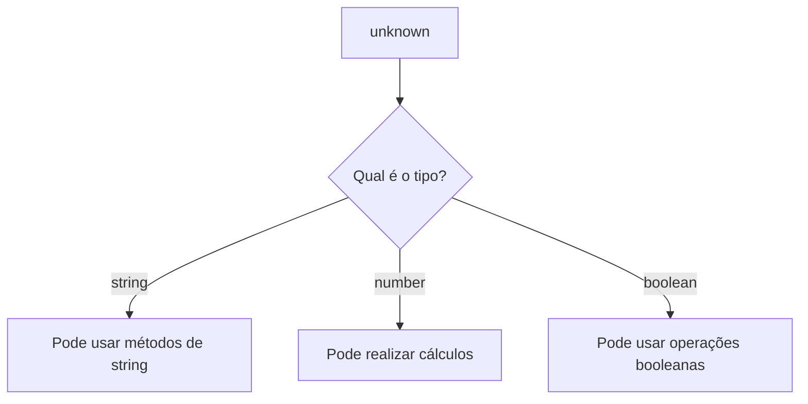

# 🏷️ Parte 2 — Tipos, Objetos e Modelagem de Dados

> [!NOTE]
> Todo sistema manipula dados.
>
> Clientes, produtos, pedidos, usuários, pagamentos...
>
> Antes de salvar qualquer informação em um banco de dados ou enviá-la para uma API, precisamos definir **como esses dados serão representados**.

---

# 🎯 Objetivos

Ao final desta seção você será capaz de:

- identificar os principais tipos do TypeScript;
- compreender a inferência de tipos;
- criar objetos tipados;
- utilizar `type` e `interface`;
- criar tipos literais;
- entender quando utilizar cada recurso.

---

# 📌 Tipos Primitivos

Assim como JavaScript, o TypeScript possui alguns tipos básicos.

```ts
let nome: string = "Maria"

let idade: number = 22

let ativo: boolean = true

let vazio: null = null

let indefinido: undefined = undefined
```

Cada variável possui apenas um tipo.

Se tentarmos atribuir outro valor...

```ts
let idade: number = 20

idade = "vinte"
```

O compilador informa o erro imediatamente.

---

> [!TIP]
>
> Os tipos funcionam como um contrato.
>
> Se você declarou que uma variável guarda números, ela deverá armazenar apenas números.

---

# 🧠 Inferência de Tipos

Na maioria das vezes nem precisamos informar o tipo.

O TypeScript consegue descobri-lo sozinho.

```ts
let nome = "Daniel"
```

O compilador entende automaticamente:

```text
nome: string
```

Outro exemplo.

```ts
let preco = 19.90
```

Inferência

```text
preco: number
```

---

## Então sempre preciso escrever os tipos?

Não.

Na verdade, uma das boas práticas do TypeScript é **deixar que ele infira sempre que possível**.

Escrevemos tipos apenas quando isso melhora a leitura ou quando a inferência não é suficiente.

---

# Curiosidade

Observe estes dois exemplos.

```ts
let linguagem = "TypeScript"
```

Tipo inferido

```text
string
```

Agora veja.

```ts
const linguagem = "TypeScript"
```

Tipo inferido

```text
"TypeScript"
```

Mas por quê?

Porque um `const` nunca pode mudar de valor.

Logo, o compilador sabe exatamente qual valor ele sempre terá.

---

> [!IMPORTANT]
>
> O TypeScript tenta ser inteligente.
>
> Quanto mais informações ele tiver, melhores serão as sugestões do VSCode e mais erros ele conseguirá encontrar.

---

# ⚠️ Tipos Especiais

Além dos tipos básicos, existem alguns tipos muito importantes.

---

# unknown

Imagine que alguém lhe entrega uma caixa fechada.

Você sabe que existe algo dentro.

Mas...

Você ainda não sabe o que é.

Isso é um `unknown`.

```ts
let valor: unknown

valor = 10

valor = "Olá"

valor = true
```

Tudo isso é permitido.

Mas existe uma regra.

Você não pode utilizar esse valor antes de descobrir seu tipo.

---

```ts
let valor: unknown = "Olá"

console.log(valor.toUpperCase())
```

Erro.

---

Precisamos verificar primeiro.

```ts
if (typeof valor === "string") {
    console.log(valor.toUpperCase())
}
```

Agora funciona.

---



---

> [!TIP]
>
> Sempre que possível prefira `unknown` ao invés de `any`.

---

# void

Algumas funções simplesmente não retornam nada.

Por exemplo.

```ts
function exibirMensagem(msg: string): void {
    console.log(msg)
}
```

A função executa uma ação.

Mas não devolve nenhum valor.

---

# never

O tipo `never` representa algo que **jamais retorna**.

Exemplo.

```ts
function erro(msg: string): never {
    throw new Error(msg)
}
```

Essa função nunca termina normalmente.

Ela sempre lança uma exceção.

Outro exemplo.

```ts
while (true) {

}
```

Esse código nunca termina.

---

> [!NOTE]
>
> Você dificilmente utilizará `never` diretamente no início da disciplina.
>
> Mas ele aparece bastante dentro do próprio TypeScript.

---

# ⚠️ E o any?

Sim.

Existe um tipo chamado `any`.

```ts
let valor: any

valor = 10

valor = "Olá"

valor = []

valor = {}
```

Tudo funciona.

Inclusive...

```ts
valor.metodoQueNaoExiste()
```

O compilador não reclama.

---

> [!WARNING]
>
> O `any` praticamente desativa a principal vantagem do TypeScript.
>
> Utilize apenas quando realmente necessário.

---

# 🏗️ Objetos

Até agora trabalhamos com valores simples.

Mas sistemas reais trabalham principalmente com objetos.

Por exemplo.

```ts
const aluno = {
    nome: "Maria",
    idade: 20,
    curso: "Desenvolvimento de Sistemas"
}
```

Observe que um objeto agrupa informações relacionadas.

---

# Tipando Objetos

Podemos informar o tipo diretamente.

```ts
const aluno: {
    nome: string
    idade: number
} = { nome: "Maria", idade: 20 }
```

Funciona.

Mas imagine um projeto com centenas de alunos.

Escrever isso toda vez seria bastante trabalhoso.

---

# Criando um type

Para evitar repetição...

Criamos um tipo personalizado.

```ts
type Aluno = {

    nome: string

    idade: number

}
```

Agora basta reutilizá-lo.

```ts
const aluno: Aluno = {

    nome: "Maria",

    idade: 20

}
```

Outro exemplo.

```ts
const professor: Aluno = {

    nome: "Carlos",

    idade: 40

}
```

---

> [!IMPORTANT]
>
> Criar tipos personalizados evita repetição de código e facilita a manutenção do sistema.

---

# Interfaces

Outra maneira de modelar objetos.

```ts
interface Aluno {

    nome: string

    idade: number

}
```

Visualmente é quase igual.

---

## Qual utilizar?

| interface | type |
|------------|------|
| Muito utilizada em bibliotecas | Muito utilizada em aplicações |
| Pode ser expandida automaticamente | Permite unions e intersections |
| Ideal para contratos públicos | Muito flexível |

---

## Nesta disciplina...

Utilizaremos principalmente:

```ts
type
```

Por ser mais flexível e suficiente para praticamente todos os exemplos que construiremos.

---

# 🏷️ Literal Types

Até agora escrevemos.

```ts
let prioridade: string
```

Mas existe um problema.

Qualquer string seria aceita.

```ts
prioridade = "banana"

prioridade = "abc"

prioridade = "qualquer coisa"
```

Nem sempre isso faz sentido.

---

Podemos restringir os valores possíveis.

```ts
type Prioridade =

    | "baixa"

    | "media"

    | "alta"
```

Agora...

```ts
let prioridade: Prioridade

prioridade = "alta"
```

Funciona.

---

```ts
prioridade = "banana"
```

Erro.

---

> [!TIP]
>
> Literal Types são muito utilizados em APIs para representar estados, papéis de usuários, permissões e categorias.

---

# Exemplo Real

Imagine um sistema de e-commerce.

```ts
type StatusPedido =

    | "Pendente"

    | "Pago"

    | "Enviado"

    | "Entregue"

    | "Cancelado"
```

Agora o pedido nunca poderá ficar com um status inválido.

---

# Modelando um Usuário

Vamos juntar tudo que aprendemos.

```ts
type Usuario = {

    id: number

    nome: string

    email: string

    ativo: boolean

}
```

Criando um objeto.

```ts
const usuario: Usuario = {

    id: 1,

    nome: "Daniel",

    email: "daniel@email.com",

    ativo: true

}
```

Perceba como o código fica muito mais legível.

---

# 💡 Ligando com Backend

Daqui a algumas aulas veremos algo parecido com isto.

```ts
type CreateUserDTO = {

    nome: string

    email: string

    senha: string

}
```

Esse objeto representará exatamente os dados enviados por um cliente para criar um novo usuário em nossa API.

Você ainda não precisa entender o que é um DTO.

Mas saiba que tudo começa com uma boa modelagem de tipos.

---

# 🧠 Resumo

Hoje aprendemos:

- Tipos primitivos
- Inferência
- unknown
- void
- never
- any
- Objetos
- type
- interface
- Literal Types

Esses conceitos serão utilizados durante toda a disciplina.

---

# ⚔️ Mini Desafio

Crie um tipo chamado **Produto** contendo:

- id
- nome
- preco
- estoque
- categoria

Depois:

1. Crie três produtos.

2. Tente atribuir um texto ao preço.

3. Observe o erro exibido pelo TypeScript.

4. Agora crie um tipo chamado:

```ts
type Categoria =
    | "Informática"
    | "Games"
    | "Livros"
```

Atualize o tipo Produto para utilizar essa categoria.

Por fim, tente criar um produto com categoria `"Alimentos"`.

O que aconteceu?
