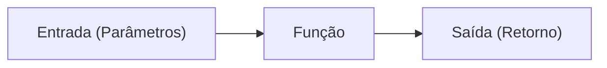
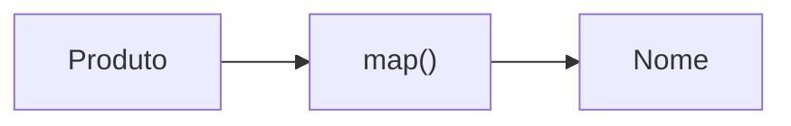
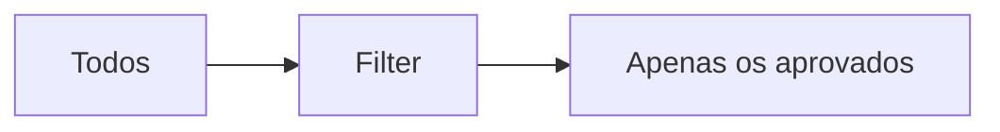
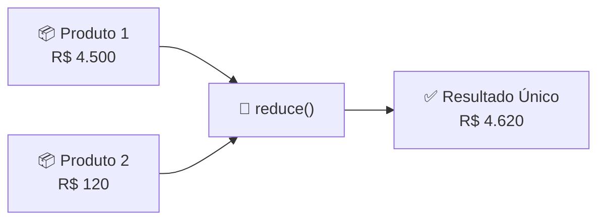
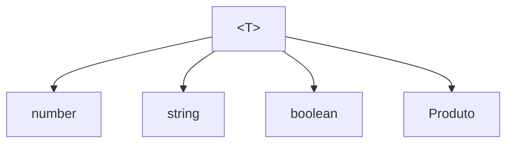

# ⚙️ Parte 3 — Funções, Arrays e Generics

> [!NOTE]
> Até agora aprendemos a modelar dados.
>
> Nesta seção aprenderemos a **manipular** esses dados.
>
> É exatamente isso que faremos durante toda a disciplina de Backend.

---

# 🎯 Objetivos

Ao final desta seção você será capaz de:

- criar funções tipadas;
- utilizar parâmetros opcionais;
- definir valores padrão;
- criar Arrow Functions;
- manipular arrays utilizando métodos modernos;
- compreender o conceito de Generics;
- entender como esses conceitos serão utilizados em APIs.

---

# 📌 O que é uma função?

Uma função é um bloco de código responsável por executar uma tarefa específica.

Pense em uma cafeteria.

Você faz um pedido.

O barista recebe esse pedido.

Prepara o café.

Entrega o resultado.

Uma função funciona exatamente dessa maneira.



---

# Criando uma função

```ts
function somar(a: number, b: number): number {

    return a + b

}
```

Observe duas informações importantes.

- parâmetros

```ts
a: number

b: number
```

- retorno

```ts
: number
```

---

## Executando

```ts
const resultado = somar(10, 5)

console.log(resultado)
```

Resultado

```text
15
```

---

# Funções sem retorno

Nem toda função precisa devolver um valor.

```ts
function boasVindas(nome: string): void {

    console.log(`Bem-vindo ${nome}`)

}
```

O tipo `void` indica que não existe retorno.

---

# Parâmetros opcionais

Algumas informações podem não existir.

```ts
function apresentar(nome: string, idade?: number) {
    
    console.log(nome)

}
```

Agora podemos chamar.

```ts
apresentar("Maria")

apresentar("João", 25)
```

Ambas funcionam.

---

# Valores padrão

Também podemos definir valores padrão.

```ts
function elevar(numero: number, potencia: number = 2) {

    return numero ** potencia

}
```

Agora.

```ts
elevar(5)
```

Resultado.

```text
25
```

---

# Rest Parameters

Quando não sabemos quantos parâmetros existirão.

```ts
function somarTudo(...numeros: number[]) {

    return numeros.reduce((a, b) => a + b)

}
```

Uso.

```ts
somarTudo(10)

somarTudo(10,20)

somarTudo(10,20,30)
```

---

# Arrow Functions

Outra maneira de escrever funções.

```ts
const multiplicar = (a: number, b: number): number => {
    
    return a * b

}
```

Quando existe apenas uma linha.

```ts
const dobro = (n: number) => n * 2
```

---

> [!TIP]
>
> Arrow Functions são muito utilizadas em callbacks e métodos de arrays.

---

# 📚 Arrays

Arrays representam coleções de dados.

```ts
const alunos: string[] = [

    "Ana",

    "Carlos",

    "Maria"

]
```

Também podemos escrever.

```ts
const alunos: Array<string> = [

]
```

As duas formas são equivalentes.

---

# Arrays de Objetos

No Backend isso será muito comum.

```ts
type Produto = {

    id: number

    nome: string

    preco: number

}
```

```ts
const produtos: Produto[] = [

    {

        id: 1,

        nome: "Notebook",

        preco: 4500

    },

    {

        id: 2,

        nome: "Mouse",

        preco: 120

    }

]
```

---

# map()

O método `map()` cria um novo array transformando cada elemento.

```ts
const nomes = produtos.map(

    produto => produto.nome

)
```

Resultado.

```text
["Notebook","Mouse"]
```

---



---

# filter()

Filtra elementos.

```ts
const caros = produtos.filter(

    produto => produto.preco > 500

)
```

Resultado.

```text
Notebook
```

---



---

# find()

Procura apenas um elemento.

```ts
const produto = produtos.find(

    p => p.id === 2

)
```

Resultado.

```text
Mouse
```

---

# reduce()

Reduz todos os elementos para um único valor.

```ts
const total = produtos.reduce((total, produto) => { return total + produto.preco }, 0)
```

Resultado.

```text
4620
```

---



---

# forEach()

Executa uma ação para cada elemento.

```ts
produtos.forEach(

    produto => console.log(produto.nome)

)
```

Diferente do map.

Não cria um novo array.

---

> [!IMPORTANT]
>
> Sempre pergunte:
>
> Quero transformar? `map()`
>
> Quero filtrar? `filter()`
>
> Quero procurar? `find()`
>
> Quero somar ou acumular? `reduce()`

---

# Enum

O TypeScript possui Enums.

```ts
enum Status {

    Pendente,

    Pago,

    Cancelado

}
```

Eles funcionam.

Mas atualmente muitos projetos preferem:

```ts
type Status =

    | "Pendente"

    | "Pago"

    | "Cancelado"
```

Porque são mais simples, geram menos código JavaScript e se integram melhor ao sistema de tipos.

---

> [!NOTE]
>
> Você encontrará Enums em projetos mais antigos.
>
> Nesta disciplina utilizaremos principalmente **Literal Types**.

---

# 🌟 Generics

Chegamos a um dos recursos mais poderosos do TypeScript.

Imagine esta função.

```ts
function primeiroElemento(lista: number[]) {

    return lista[0]

}
```

Ela funciona apenas para números.

Agora imagine outra.

```ts
function primeiroTexto(lista: string[]) {

    return lista[0]

}
```

Começamos a repetir código.

---

# A solução

Generics.

```ts
function primeiroElemento<T>(lista: T[]): T {

    return lista[0]
    
}
```

Agora.

```ts
primeiroElemento([1,2,3])

primeiroElemento(["A","B","C"])

primeiroElemento([true,false])
```

Tudo funciona.

---



---

# Por que isso é importante?

Daqui a algumas aulas veremos algo parecido.

```ts
type ApiResponse<T> = {

    success: boolean

    data: T

}
```

Agora podemos criar.

```ts
ApiResponse<Usuario>

ApiResponse<Produto>

ApiResponse<Pedido>
```

Sem repetir código.

---

# Ligando com Backend

Uma função de um Service costuma ser parecida com esta.

```ts
async function findAllUsers():

Promise<Usuario[]> {

}
```

Observe que praticamente tudo que aprendemos até agora aparece aqui.

- Funções
- Promise
- Arrays
- Objetos
- Types

É exatamente isso que construiremos nas próximas aulas.

---

# 🧠 Resumo

Hoje aprendemos:

- Funções
- Retorno
- void
- Arrow Functions
- Rest Parameters
- Arrays
- map
- filter
- find
- reduce
- forEach
- Enums
- Generics

---

# ⚔️ Mini Desafio

Crie um tipo chamado **Livro**.

```ts
type Livro = {

    id: number

    titulo: string

    autor: string

    preco: number

}
```

Depois:

1. Crie um array com cinco livros.

2. Utilize `map()` para listar apenas os títulos.

3. Utilize `filter()` para mostrar apenas os livros acima de R$ 100.

4. Utilize `find()` para localizar um livro pelo id.

5. Utilize `reduce()` para calcular o valor total de todos os livros.

---

# ⭐ Desafio do Mestre

Crie uma função genérica chamada:

```ts
function ultimoElemento<T>(lista: T[]): T
```

Ela deverá retornar o último elemento de qualquer array.

Depois teste com:

- números
- strings
- objetos
- booleanos

Sem alterar a implementação da função.