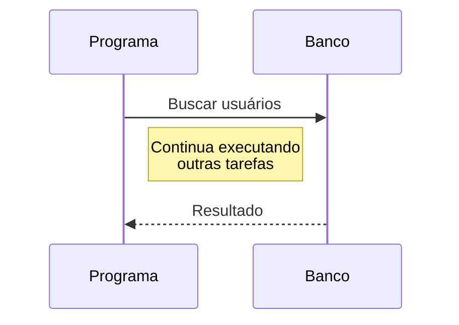
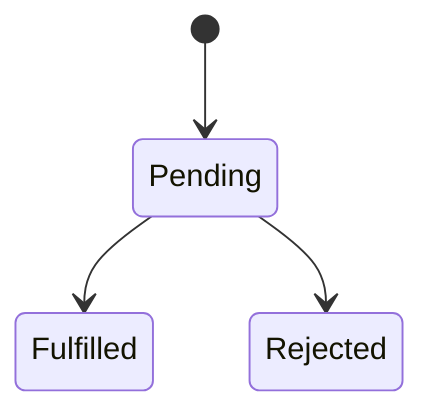
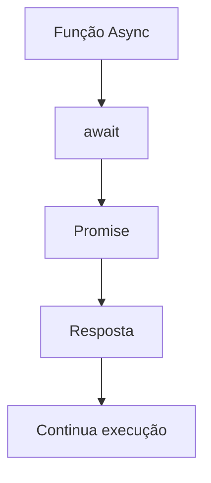
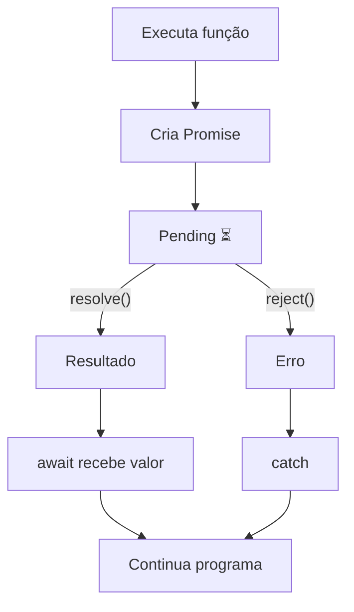
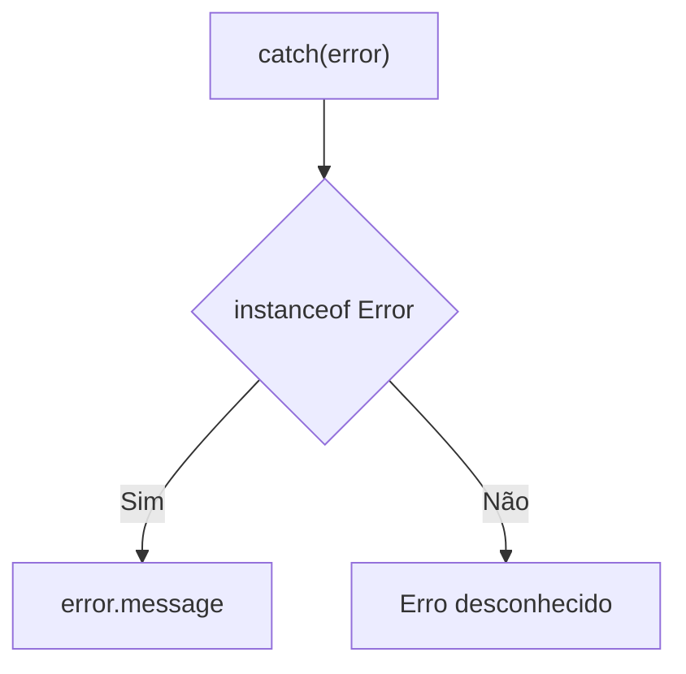
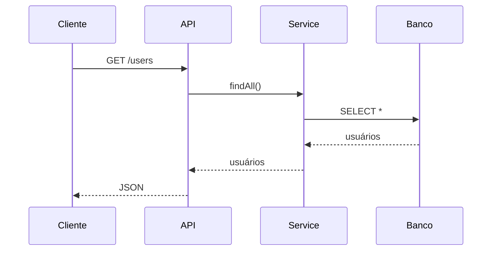

# ⏳ Parte 4 — Programação Assíncrona com Promise e Async/Await

> [!NOTE]
> Imagine que seu sistema precisa consultar um banco de dados.
>
> Essa consulta pode levar alguns milissegundos... ou até vários segundos.
>
> Enquanto isso acontece...
>
> O programa deve parar completamente?
>
> A resposta é **não**.
>
> É exatamente para resolver esse problema que existe a programação assíncrona.

---

# 🎯 Objetivos

Ao final desta seção você será capaz de:

- compreender a diferença entre código síncrono e assíncrono;
- entender o funcionamento das Promises;
- utilizar `async` e `await`;
- tratar erros utilizando `try/catch`;
- compreender por que APIs utilizam programação assíncrona.

---

# 🕐 Código Síncrono

Vamos começar com um exemplo simples.

```ts
console.log("Início")

console.log("Processando...")

console.log("Fim")
```

Resultado.

```text
Início

Processando...

Fim
```

Cada instrução espera a anterior terminar.


Esse comportamento é chamado de **execução síncrona**.

---

# 🤔 Onde está o problema?

Imagine agora que o programa precisa consultar um banco de dados.

Essa consulta demora 5 segundos.

```
Banco...

⌛⌛⌛⌛⌛
```

Durante esse tempo...

Nada mais acontece.

```
Sistema parado.
```

Isso seria péssimo.

---

# A vida real

Imagine um restaurante.

Você faz um pedido.

O cozinheiro demora 30 minutos.

Você fica parado olhando para a cozinha?

Claro que não.

Você conversa.

Olha o celular.

Bebe água.

Espera ser chamado.

Seu programa faz exatamente isso.

---

# Programação Assíncrona

Em vez de esperar parado...

O programa continua executando outras tarefas.



---

# Promise

Uma Promise representa uma operação que **ainda não terminou**.

Ela promete entregar um resultado no futuro.

---

Imagine um pedido de pizza.

Você faz o pedido.

Recebe um comprovante.

A pizza ainda não chegou.

Mas chegará.

A Promise funciona exatamente assim.

---

# Estados de uma Promise

Uma Promise possui três estados.



---

## Pending

A operação ainda está sendo executada.

```
⌛ Aguarde...
```

---

## Fulfilled

Tudo deu certo.

```
✅ Resultado disponível
```

---

## Rejected

Algo deu errado.

```
❌ Erro
```

---

# Criando uma Promise

```ts
const promessa = new Promise<string>((resolve, reject) => {

    resolve("Olá!")

})
```

Observe.

```
resolve()

↓

Sucesso
```

```
reject()

↓

Erro
```

---

# Simulando um acesso ao banco

```ts
function buscarUsuario(): Promise<string> {

    return new Promise((resolve) => {

        setTimeout(() => {

            resolve("Daniel")

        }, 3000)

    })

}
```

---

# Consumindo uma Promise

Antes do async/await...

Era comum utilizar.

```ts
buscarUsuario()

.then(usuario => {

    console.log(usuario)

})
```

Funciona.

Mas imagine várias consultas.

```ts
buscar()

.then(() => {

})

.then(() => {

})

.then(() => {

})

.catch(() => {

})
```

Começa a ficar difícil de ler.

---

# Surge o async/await

O objetivo é tornar o código mais parecido com código síncrono.

```ts
async function main() {

    const usuario = await buscarUsuario()

    console.log(usuario)

}
```

Muito mais simples.

---

# O que significa async?

Uma função marcada com `async`

```ts
async function exemplo() {

}
```

Sempre retorna uma Promise.

Mesmo que você não escreva isso.

Na prática.

```ts
async function exemplo() {

    return 10

}
```

É equivalente a.

```ts
function exemplo() {

    return Promise.resolve(10)

}
```

---

# O que significa await?

O `await` significa literalmente.

> Espere esta Promise terminar.

Mas atenção.

Ele não trava o Node inteiro.

Ele pausa apenas aquela função.

---



---

# Fluxo completo



---

# Tratando erros

Sempre que usamos `await`

é recomendado utilizar

```ts
try/catch
```

```ts
async function main() {

    try {

        const usuario = await buscarUsuario()

        console.log(usuario)

    }

    catch(error) {

        console.log(error)

    }

}
```

---

# O tipo unknown

Desde versões recentes do TypeScript.

O erro do catch possui tipo.

```ts
unknown
```

Por quê?

Porque qualquer coisa pode ser lançada.

```ts
throw "Erro"

throw 10

throw true

throw {}
```

---

# Como tratar corretamente

```ts
try {

}

catch(error: unknown) {

    if(error instanceof Error) {

        console.log(error.message)

    }

}
```

---



---

> [!IMPORTANT]
>
> Nunca assuma que o erro é sempre uma instância de `Error`.

---

# Ligando com Backend

Agora tudo começa a fazer sentido.

Quando escrevemos.

```ts
const usuarios = await repository.findAll()
```

O que realmente acontece é algo parecido com isto.



Enquanto o banco está processando a consulta...

O Node continua atendendo outras requisições.

É isso que torna aplicações Node tão eficientes.

---

# Exemplo Completo

```ts
function buscarUsuario(): Promise<string> {

    return new Promise((resolve) => {

        setTimeout(() => {

            resolve("Daniel")

        }, 2000)

    })

}

async function main() {

    console.log("Início")

    const usuario = await buscarUsuario()

    console.log(usuario)

    console.log("Fim")

}

main()
```

Resultado.

```text
Início

(2 segundos)

Daniel

Fim
```

---

# 🧠 Resumo

Hoje aprendemos.

- Código síncrono
- Código assíncrono
- Promise
- Pending
- Fulfilled
- Rejected
- async
- await
- try/catch
- unknown

---

# ⚔️ Mini Desafio

Crie uma função chamada

```ts
buscarProduto()
```

Ela deverá:

- retornar uma Promise;
- esperar 3 segundos utilizando `setTimeout`;
- retornar o nome de um produto.

Depois.

Crie uma função `main()` que utilize `await` para exibir o resultado.

---

# ⭐ Desafio do Mestre

Altere a função para que exista 50% de chance de erro.

Utilize.

```ts
Math.random()
```

Quando ocorrer erro.

Utilize.

```ts
reject(new Error("Produto não encontrado"))
```

Depois trate esse erro corretamente utilizando.

```ts
try/catch
```

e

```ts
instanceof Error
```

---

# 🚀 Preparando a próxima aula

Tudo o que vimos aqui será utilizado nas próximas aulas.

Quando criarmos nossa primeira API com Express, praticamente todos os métodos terão esta estrutura:

```ts
async function findAll(): Promise<Usuario[]> {

    // consulta ao banco

}
```

Agora você já entende **por que** essas funções são assíncronas e **como** o TypeScript ajuda a torná-las mais seguras.